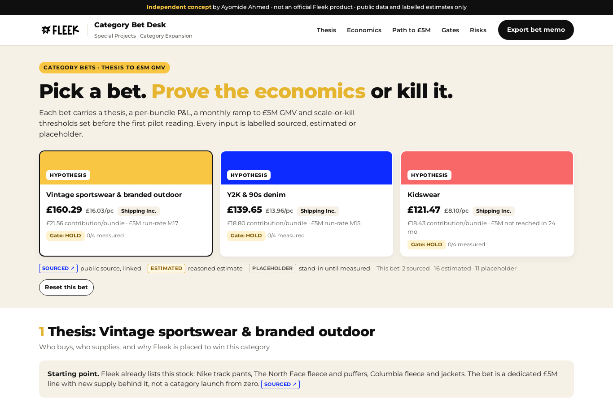

# Category Bet Desk

**An independent concept by Ayomide Ahmed. It is not an official Fleek product, is not affiliated with or endorsed by Fleek, and uses no Fleek internal data.** The Fleek name and logo belong to Fleek and appear only to show how the tool would sit inside its product.

Live demo (no sign-in): **https://cashpointsoulja.github.io/category-bet-desk/**

Category Bet Desk is a thesis-to-economics workbench for one seat: Fleek's [Special Projects Lead, Category Expansion](https://www.ycombinator.com/companies/fleek/jobs/Iopbt9d-special-projects-lead-category-expansion). That role takes a new category bet from thesis to first suppliers, first GMV and a feasible-or-not call, with each bet sized to add £5M+ GMV. The desk puts the whole case for one bet on one screen and turns it into a one-page memo.



## What it does

Pick one of three preloaded bets: **vintage sportswear & branded outdoor**, **Y2K & 90s denim**, or **kidswear**. For the chosen bet the desk shows:

1. **Thesis card.** Who buys, who supplies, why Fleek wins, and the starting point (each of these categories is already listed on joinfleek.com, so each bet is a scale-up, not a launch from zero).
2. **Unit economics per bundle.** Supplier cost by grade (A/B/C mix), FleekSort grading cost, take rate, shipping built into the price against actual freight, payments and BNPL cost, returns and dispute leakage, buyer CAC and CAC payback. A price check compares the calculated £/pc with public listing prices.
3. **Path to £5M GMV.** A 24-month ramp where each month sells the lower of supplier capacity and buyer demand, with editable supply and demand assumptions, a chart against the £5M run-rate line, a one-way sensitivity table (±20% on each input) and three live two-way tables.
4. **Stage-gate scorecard.** Scale and kill lines plus a minimum sample for repeat-buyer rate, dispute rate, contribution per bundle and grading agreement. One kill on an adequate sample kills the bet; scaling needs every metric past its scale line; missing or thin evidence holds. Illustrative pilot readings (clearly labelled as made up) show one SCALE, one HOLD and one KILL.
5. **Risks and open questions.** Each item has a severity and a next step. You can add, close and reopen items.

**Export bet memo** opens the print dialog with an A4 one-page memo (save as PDF from the dialog).

Every assumption carries a label: **Sourced** (with a link to the public page), **Estimated** (a reasoned figure), or **Placeholder** (a stand-in until measured). Editing a sourced value relabels it as estimated. Edits are saved in your browser only.

## Honesty rules

- Public facts are linked in [docs/source-ledger.md](docs/source-ledger.md). Where public sources disagree (for example 45,000+ buyers on the home page vs 50,000+ in the Series B coverage), both are recorded.
- No Fleek take rate, CAC, dispute rate, freight cost or grading cost is public. Those inputs are placeholders and say so.
- The pilot readings in the scorecard are invented to demonstrate the gate logic. They are not observations.

## Run it

```bash
npm ci
npm run dev        # http://localhost:3000
npm test           # unit tests: economics against hand-calculated cases
npm run typecheck
npm run build      # static export to out/
npm run build:pages  # same, with the /category-bet-desk base path for GitHub Pages
```

Next.js 14 (App Router, static export) and TypeScript. The economics engine is pure functions in [`lib/engine.ts`](lib/engine.ts); the three bets are in [`lib/categories.ts`](lib/categories.ts).

## Docs

| Doc | |
|---|---|
| [Brand sheet](docs/brand-sheet.md) and [visual guide](docs/visual-guide.md) | Fleek's public look, written before the build |
| [PRD](docs/prd.md) | Problem, user, scope, requirements |
| [Five Whys](docs/five-whys.md) | Why category bets stall without one shared case |
| [Jobs to be done](docs/jtbd.md) | The jobs of the bet owner and the people they report to |
| [Success metrics](docs/success-metrics.md) | How we would know the desk works |
| [Test plan and results](docs/test-plan.md) | What was tested and the recorded output |
| [Viability memo](docs/viability-memo.md) | Why this matters for the Special Projects Lead role |
| [v2 roadmap](docs/roadmap-v2.md) | What comes next |
| [Demo script](docs/demo-script.md) | Timed voiceover for a 2.5-minute walkthrough |
| [Source ledger](docs/source-ledger.md) | Every public source, what was taken, and when |

---

independent concept by Ayomide Ahmed
