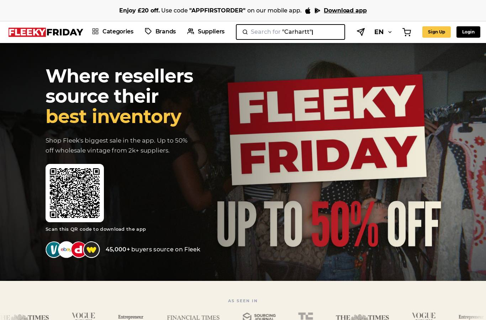
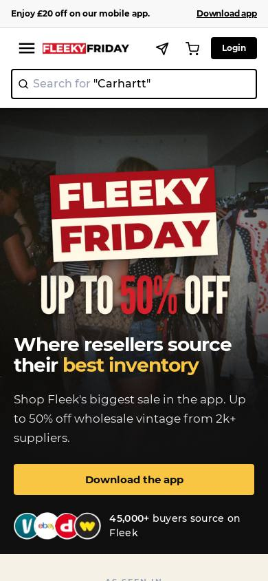
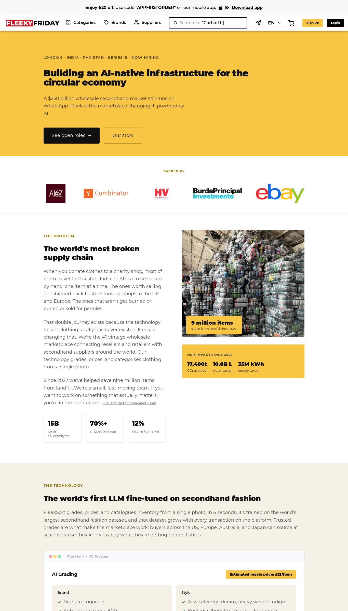
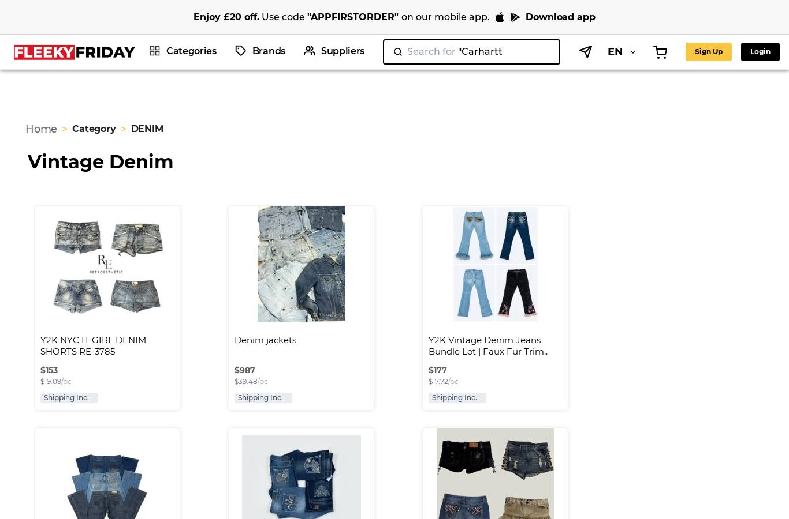
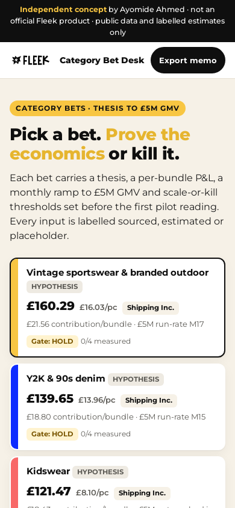
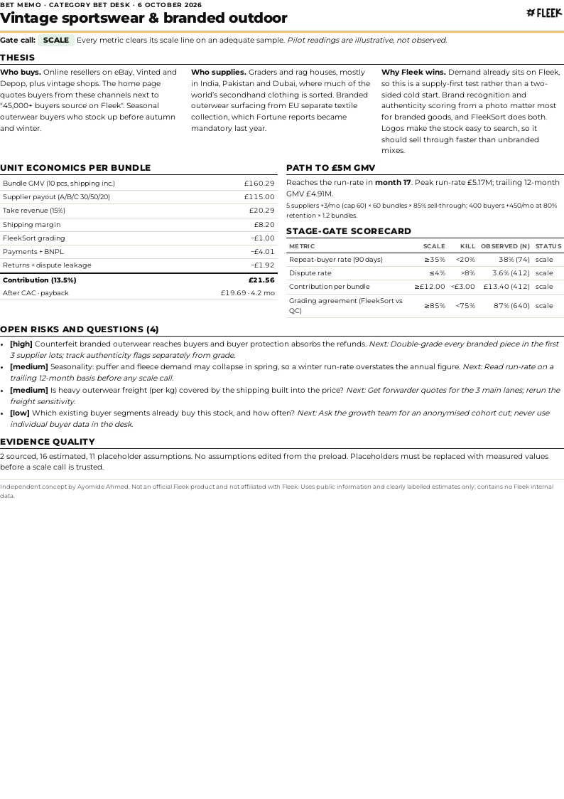

# Visual guide

How Category Bet Desk borrows Fleek's public look, screen by screen. Read with [brand-sheet.md](brand-sheet.md), which holds the tokens.

Reference captures of the live site (6 October 2026, public pages, no sign-in):

| Fleek page | Capture | What we took from it |
|---|---|---|
| Home, 1366 px |  | White header, logo top-left, pill buttons in black and yellow, bold sentence-case headline with one yellow phrase |
| Home, 390 px |  | Single column, logo row, full-width cards, no horizontal scroll |
| Careers, 1366 px |  | Yellow and cream bands, tracked eyebrow labels, stat tiles with one big number |
| Denim category, 1366 px |  | Listing card: title, bold bundle price, grey £/pc line, "Shipping Inc." chip |

## Layout rules

1. **Logo.** The official black FLEEK starburst wordmark, transparent WebP, unmodified, top-left of the sticky header at 30 px high (22 px on mobile). Never recoloured, cropped or placed on yellow.
2. **Independence notice.** A black top strip carries "Independent concept by Ayomide Ahmed · not an official Fleek product" on every screen, and the footer repeats "independent concept by Ayomide Ahmed".
3. **Hero band.** Cream (`#f6f1e7`), yellow eyebrow pill, 800-weight headline with one phrase in dark yellow.
4. **Bet cards = listing cards.** Coloured tile, a HYPOTHESIS badge where Fleek shows a grade badge, the bundle price in bold, £/pc in grey, the "Shipping Inc." chip, then contribution and the gate chip.
5. **Sections.** Numbered 1-5 in dark yellow, white background except the ramp band which is cream, so the long middle of the page has rhythm.
6. **Numbers.** Tabular figures, right-aligned, negative values in red with a true minus sign.
7. **Status colour.** Green = scale, amber = hold / insufficient, red = kill / invalid. Colour is always paired with a word, never colour alone.
8. **Assumption labels.** Blue outlined `SOURCED ↗` (a link), yellow `ESTIMATED`, dashed grey `PLACEHOLDER`. The dashed border means "not real yet".
9. **Buttons.** Pill shape, 2 px black border, 44 px minimum touch height. One black primary action per area (Export bet memo).
10. **Print memo.** A4, one page, a yellow rule under the title, the logo top-right, two columns, the independence line in the footer.

## Our screens

| Desktop 1366 px | Mobile 390 px |
|---|---|
|  |  |

Printed memo: 

## What we did not copy

- The seasonal "FLEEKY FRIDAY" header lockup.
- Search, sign-in, cart and supplier navigation: the desk is a single internal tool, not a storefront.
- Product photography. Category tiles use flat brand colours instead of Fleek's photos.
